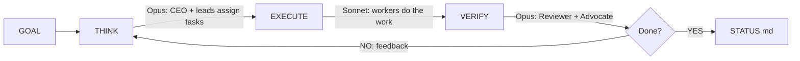

# /company

[](https://www.npmjs.com/package/company-skill) [](LICENSE) [](https://www.npmjs.com/package/company-skill)

> *You don't prompt agents one at a time. You write a team in markdown, hand them a goal, and go to sleep. In the morning, STATUS.md tells you what got done, what got rejected, and what the company learned. The playbook from session 3 makes session 4 faster. By session 10, the company runs itself better than you could direct it manually.*

**Define your team in markdown. Give it a goal. Walk away.**

A Claude Code skill that runs your entire company — CEO delegates, departments execute in parallel, built-in reviewers verify — and doesn't stop until the goal is done.

```
/company "Build the user auth system with OAuth2"
```

## Why /company

| | Without /company | With /company |
|---|---|---|
| Task routing | You manually prompt each agent | CEO reads the goal, picks relevant employees, delegates |
| Quality gates | Hope it's correct | Reviewer + Devil's Advocate + Elegance Enforcer triple-check |
| Knowledge retention | Lost every session | Playbook accumulates what worked, what failed, what's faster |
| Parallelism | One agent at a time | All departments run in parallel |
| Stopping condition | You decide when it's done | criteria.json blocks exit until ALL criteria pass |

## Quick Start

**1. Install**
```bash
npx company-skill install
```

**2. Define your team** (optional — a minimal company is created automatically)
```markdown
## Engineering
- Backend Lead, API design and database architecture
- Frontend Dev, React components and state management

## Research
- ML Scientist, model experiments and benchmarks
```

**3. Run**
```
/company "Build a REST API for user management with tests"
```

## How It Works



The loop does NOT stop until the Reviewer confirms all criteria pass AND the Devil's Advocate accepts. There is no iteration limit.

<details>
<summary><strong>THINK</strong> — CEO picks relevant employees, leads assign tasks</summary>

The CEO reads the goal and COMPANY.md, decides which departments and employees are relevant (a mobile app goal doesn't need a Topologist), writes an active roster, then launches all department leads in parallel. Each lead assigns tasks to their employees with one sentence, one skill, and context.

If a lead sees a skill gap, they write `HIRE: {role}, {why}` and the CEO adds it to the team.
</details>

<details>
<summary><strong>EXECUTE</strong> — All workers run in parallel with installed skills</summary>

Every employee gets their task, previous findings, and failed approaches from the playbook. Every finding must have a source — file path, URL, or command output. Novel ideas use "NOVEL — needs validation" and the reviewer adds a validation criterion. No source = rejected.
</details>

<details>
<summary><strong>VERIFY</strong> — Triple quality gate blocks premature completion</summary>

**Internal Reviewer** checks each criterion in criteria.json against evidence. No evidence? Stays `false`.

**Devil's Advocate** attacks anything marked as passing. "Is this actually complete or surface-level? What edge cases were missed?"

**Elegance Enforcer** asks "Can this be simpler? Does every component justify its existence?"

All three must accept before the loop exits.
</details>

## Goal Enforcement

The skill creates `criteria.json` with machine-checkable success criteria:

```json
{"goal": "Build auth", "criteria": [
  {"id": 1, "description": "OAuth2 login works with Google", "passes": false, "evidence": null},
  {"id": 2, "description": "All tests pass", "passes": false, "evidence": null}
]}
```

A Stop Hook reads this file and **blocks Claude from exiting** until every criterion passes. To cancel: `touch .company/CANCEL`.

## Self-Improving Playbook

One file: `.company/playbook.md`. Accumulates across sessions.

After each session, the CEO writes what worked, what failed (and what to use instead), what was slow (and what's faster), which employees performed best, and which roles to hire or deactivate. Leads read the playbook before every THINK phase.

**The company that starts session 5 is smarter than session 1.**

The CEO also evolves COMPANY.md: tags `[inactive]` on zero-contribution roles, `[priority]` on top performers, and updates employee descriptions based on what they're actually good at.

## Built-In Roles

Every company gets these automatically (deduplicated if you define them in COMPANY.md):

| Role | Phase | Purpose |
|------|-------|---------|
| CEO | THINK | Reads goal, picks relevant employees, resolves conflicts |
| CTO | THINK | Technical decisions, architecture review |
| Internal Reviewer | VERIFY | Checks criteria.json, rejects findings without sources |
| User Advocate | VERIFY | "Would a real user understand this?" |
| Devil's Advocate | VERIFY | Attacks results, finds holes, prevents false completion |
| Elegance Enforcer | VERIFY | Prevents over-engineering, kills unnecessary complexity |

A 2-person COMPANY.md (Backend Dev + Frontend Dev) automatically gets CEO + CTO + both devs + all 4 reviewers = **8 employees running**.

## Model Assignment

| Phase | Model | Who |
|-------|-------|-----|
| THINK | Opus | CEO, CTO, department leads |
| EXECUTE | Sonnet | Workers |
| VERIFY | Opus | All reviewers |
| COMPRESS | Haiku | Digest writer |

Override per employee: `- ML Scientist, experiments [opus]`

## Commands

```
/company "Build X"      Run until X is done
/company                Run using COMPANY.md priorities
/company:run "Build X"  Same as above
/company:status         Show last status
/company:resume         Continue from last session
```

## Installed Skills

Auto-installed on first run. When installed, employees MUST use them.

| Pack | What employees get |
|------|-------------------|
| gstack | /review, /ship, /qa, /investigate, /browse |
| GSD | /gsd-plan-phase, /gsd-execute-phase, /gsd-verify-work, /gsd-debug |
| trailofbits | Security audit, vulnerability detection |

<details>
<summary>Install more skill packs</summary>

```
/plugin marketplace add obra/superpowers-marketplace
/plugin marketplace add wshobson/agents
/plugin marketplace add alirezarezvani/claude-skills
```
</details>

## What Gets Created

```
.company/
  criteria.json        Machine-checkable goal state
  playbook.md          Accumulated lessons (THE self-improvement file)
  active-roster.md     Employees activated for this goal
  active-tasks.md      Deduplicated task list
  STATUS.md            Final report
  cycles/              Per-cycle briefings and reviews
  messages/            Typed findings per department
  {dept}/              Per-employee findings (persist across sessions)
```

## Design Choices

Three principles behind the skill:

- **One file to define the team.** COMPANY.md is the only thing you write. Everything else — delegation, task routing, quality checks — is automatic.
- **No iteration limit.** The loop runs until criteria.json says done. Not 3 cycles. Not 5. Until the Reviewer and Devil's Advocate both accept.
- **Self-improvement over configuration.** Instead of tuning prompts, the company learns from its own failures. The playbook accumulates across sessions. Roles get tagged `[priority]` or `[inactive]` based on performance. The system gets better by running, not by tweaking.

## Project Structure

```
COMPANY.md           Your team definition (the only file you edit)
skill/SKILL.md       The skill logic (THINK > EXECUTE > VERIFY loop)
agents/              Subagent definitions (lead, worker, reviewer, critic, digest)
hooks/               Stop guard, session restore, precompact
commands/            run.md, resume.md, status.md
examples/            Sample team configurations
install.sh           Curl-based installer
bin/install.js       npx installer
```

## Examples

| File | Team |
|------|------|
| [`startup.md`](examples/startup.md) | 10-person startup |
| [`research-lab.md`](examples/research-lab.md) | Academic group |
| [`dev-team.md`](examples/dev-team.md) | Dev sprint |
| [`nexusquant.md`](examples/nexusquant.md) | Full research company |

## License

MIT
