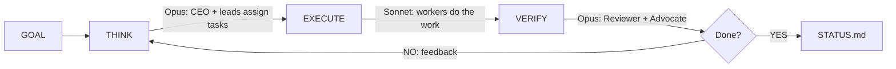

# /company

[](https://www.npmjs.com/package/company-skill) [](LICENSE) [](https://www.npmjs.com/package/company-skill)

**Define your team in markdown. Give it a goal. Walk away.**

A Claude Code skill that runs your whole company. The CEO delegates, departments execute in parallel, and built-in reviewers verify the work before it counts as done. The loop keeps running until the goal is met.

```
/company "Build the user auth system with OAuth2"
```

You write the team once in COMPANY.md and hand over a goal. By the morning STATUS.md tells you what shipped, what got rejected, and what the run learned. The playbook from one session carries into the next, so later sessions move faster than the first.

## Why /company

Run a goal yourself and you prompt each agent in turn, hope the output is right, lose every lesson when the session ends, work one agent at a time, and decide on your own when things are finished.

With /company the CEO reads the goal and picks the relevant employees. Three reviewers (Reviewer, Devil's Advocate, Elegance Enforcer) check the work. The playbook keeps what worked and what failed across sessions. Departments run at the same time. And criteria.json holds the exit shut until every criterion passes.

## Quick start

**1. Install**
```bash
npx company-skill install
```

**2. Define your team.** This step is optional. If you skip it, a minimal company is created for you.
```markdown
## Engineering
- Backend Lead, API design and database architecture
- Frontend Dev, React components and state management

## Research
- ML Scientist, model experiments and benchmarks
```

**3. Run**
```
/company "Build a REST API for user management with tests"
```

## How it works



The loop stops only when the Reviewer confirms every criterion passes and the Devil's Advocate accepts. There is no iteration limit.

<details>
<summary><strong>THINK</strong>, CEO picks relevant employees, leads assign tasks</summary>

The CEO reads the goal and COMPANY.md, decides which departments and employees are relevant (a mobile app goal does not need a Topologist), writes an active roster, then launches all department leads in parallel. Each lead hands their employees a task in one sentence with a skill and the context they need.

If a lead spots a skill gap, they write `HIRE: {role}, {why}` and the CEO adds it to the team.
</details>

<details>
<summary><strong>EXECUTE</strong>, all workers run in parallel with installed skills</summary>

Every employee gets their task, the previous findings, and the failed approaches from the playbook. Every finding must cite a source: a file path, a URL, or command output. Novel ideas get tagged "NOVEL, needs validation" and the reviewer adds a validation criterion for them. No source means the finding is rejected.
</details>

<details>
<summary><strong>VERIFY</strong>, the quality gate that blocks premature completion</summary>

The Internal Reviewer checks each criterion in criteria.json against the evidence. No evidence keeps it `false`. It also scans public-facing output for unverified claims about external projects. Any number, percentage, or technical detail cited from memory is blocked until it is verified from source.

The Devil's Advocate attacks anything marked as passing. Is this actually complete or only surface-level? What edge cases were missed? For any claim about an external project, did you verify it from their repo or docs, or are you guessing?

The Elegance Enforcer asks whether the work can be simpler and whether every component earns its place.

All three have to accept before the loop exits.
</details>

## External fact verification

Workers producing public output (GitHub comments, PRs, blog posts) verify every claim about external projects against the actual docs or source before publishing. No citing from memory. The reviewer blocks unverified external claims on its own.

One strike rule: if someone corrects you, reply "my bad, you're right" and stop. Do not try a second correction with more guessed detail.

## Goal enforcement

The skill writes a `criteria.json` with machine-checkable success criteria:

```json
{"goal": "Build auth", "criteria": [
  {"id": 1, "description": "OAuth2 login works with Google", "passes": false, "evidence": null},
  {"id": 2, "description": "All tests pass", "passes": false, "evidence": null}
]}
```

A Stop Hook reads this file and blocks Claude from exiting until every criterion passes. To cancel, run `touch .company/CANCEL`.

## Self-improving playbook

Everything lives in one file, `.company/playbook.md`, and it grows across sessions.

After each session the CEO records what worked, what failed and what to use instead, what was slow and what is faster, which employees did best, and which roles to hire or deactivate. Leads read the playbook before every THINK phase, so a run that starts at session 5 knows more than it did at session 1.

The CEO also keeps COMPANY.md current. It tags `[inactive]` on roles that contributed nothing, `[priority]` on the strong performers, and rewrites employee descriptions to match what each one is actually good at.

## Built-in roles

Every company gets these automatically, deduplicated if you also define them in COMPANY.md.

* CEO (THINK): reads the goal, picks relevant employees, resolves conflicts.
* CTO (THINK): technical decisions and architecture review.
* Internal Reviewer (VERIFY): checks criteria.json, rejects findings without sources.
* User Advocate (VERIFY): asks whether a real user would understand this.
* Devil's Advocate (VERIFY): attacks results, finds holes, prevents false completion.
* Elegance Enforcer (VERIFY): prevents over-engineering, kills unnecessary complexity.

So a two-person COMPANY.md (Backend Dev plus Frontend Dev) ends up running eight employees: CEO, CTO, both devs, and all four reviewers.

## Model assignment

* THINK runs on Opus: CEO, CTO, department leads.
* EXECUTE runs on Sonnet: the workers.
* VERIFY runs on Opus: all reviewers.
* COMPRESS runs on Haiku: the digest writer.

Override per employee like this: `- ML Scientist, experiments [opus]`

## Commands

```
/company "Build X"      Run until X is done
/company                Run using COMPANY.md priorities
/company:run "Build X"  Same as above
/company:status         Show last status
/company:resume         Continue from last session
```

## Installed skills

These install on first run. Leads match a skill to each worker by task type.

* Code review uses /review (gstack).
* Bug fixes use /investigate (gstack).
* QA testing uses /qa (gstack).
* Shipping code uses /ship (gstack).
* Browsing or testing a site uses /browse (gstack).
* Security audits use /secure-phase (trailofbits).
* Stateful debugging uses /gsd-debug (GSD).
* Planning work uses /gsd-plan-phase (GSD).

When no skill matches the task, workers fall back to raw tools.

<details>
<summary>Install more skill packs</summary>

```
/plugin marketplace add obra/superpowers-marketplace
/plugin marketplace add wshobson/agents
/plugin marketplace add alirezarezvani/claude-skills
```
</details>

## What gets created

```
.company/
  criteria.json        Machine-checkable goal state
  playbook.md          Accumulated lessons (THE self-improvement file)
  active-roster.md     Employees activated for this goal
  active-tasks.md      Deduplicated task list
  STATUS.md            Final report
  cycles/              Per-cycle briefings and reviews
  messages/            Typed findings per department
  {dept}/              Per-employee findings (persist across sessions)
```

## Design choices

Four ideas shape the skill.

One file defines the team. COMPANY.md is the only thing you write. Delegation, task routing, and quality checks all happen on their own.

No iteration limit. The loop runs until criteria.json says it is done, however many cycles that takes, and only once the Reviewer and the Devil's Advocate both accept.

Self-improvement over configuration. Rather than tune prompts, the company learns from its own failures. The playbook grows across sessions, roles get tagged `[priority]` or `[inactive]` by performance, and the system improves by running rather than by tweaking.

Reports stay short. Every employee, reviewer, and the CEO reports the conclusion first and the evidence that backs it, then stops. No narration, no restating the task, no walls of dense text - the minimum that carries the result. The one thing brevity never cuts is the source: a claim still ships with the command, file, or link that proves it.

## Project structure

```
COMPANY.md           Your team definition (the only file you edit)
skill/SKILL.md       The skill logic (THINK > EXECUTE > VERIFY loop)
agents/              Subagent definitions (lead, worker, reviewer, critic, digest)
hooks/               Stop guard, session restore, precompact
commands/            run.md, resume.md, status.md
examples/            Sample team configurations
install.sh           Curl-based installer
bin/install.js       npx installer
```

## Examples

* [`startup.md`](examples/startup.md): a 10-person startup.
* [`research-lab.md`](examples/research-lab.md): an academic group.
* [`dev-team.md`](examples/dev-team.md): a dev sprint.
* [`nexusquant.md`](examples/nexusquant.md): a full research company.

## License

MIT

## Restarting when context fills up (`/company restart`)

A long autonomous run will eventually fill the model's context window. Instead of re-explaining the whole state to a fresh session by hand, run:

```
/company restart
```

It refreshes the on-disk state (`criteria.json`, `STATUS.md`, `NEXT.md`, the playbook) and emits one self-contained continuation prompt. That prompt carries the goal, a trust-nothing re-derivation first step, the exact merged, in-flight, and pending state with PR numbers and commit SHAs, the pending task list, the founder-gated waits, the rules and gates to honor, and the environment. Copy the block, run `/clear`, paste it into a new session, and you resume with nothing lost.

The prompt is never hand-written. The procedure runs a Source-Verifier, Devil's-Advocate, and Completeness pass to re-derive every SHA, PR, CI, and prod claim live before it emits, and it outputs only the prompt block with no trailing commentary.

When it fires on its own, and the honest limits:

* At compaction, the reliable trigger. Claude Code has no hook that fires at a context percentage. The closest hard wiring is compaction. The `PreCompact` hook (`hooks/precompact.js`) snapshots state to `.company/.checkpoint.md`, and the post-compaction `SessionStart` hook (`hooks/session-restore.js`, matcher `compact`) injects an instruction telling the model to run `/company restart` and emit the handoff. This is wired and survives compaction. `PreCompact` is shell-only, so it cannot emit the prompt itself. The model does that right after, nudged by the restore hook.
* Around 50 percent is best-effort, not mechanical. The skill tells the model to self-trigger when it sees a context-usage warning at or above 50 percent, but nothing enforces it. No 50 percent hook exists, so it may not fire until compaction. Treat `/company restart` typed by hand as the dependable control.
