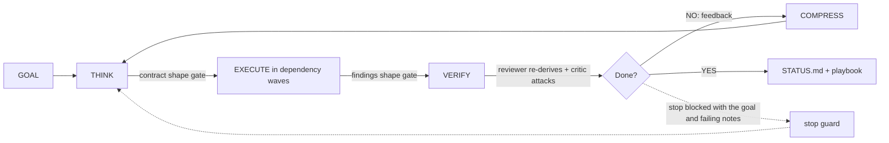

# /company

[](https://www.npmjs.com/package/company-skill) [](https://www.npmjs.com/package/company-skill) [](https://github.com/jagmarques/company-skill/actions/workflows/check.yml) [](LICENSE)

**The agent company that can't stop until the work is verified done.**

Your agent stops when it feels done. This makes it stop only when the work is actually done.

```bash
npx company-skill install
```

```
/company "Build a REST API for user management with tests"
```

Optionally define your team first in `COMPANY.md` (skip it and a minimal company is created):

```markdown
## Engineering
- Backend Lead, API design and database architecture
- Frontend Dev, React components and state management
```


## Why

Single-pass agents grade their own homework. One pass, one verdict, done. Swarm harnesses multiply agents without multiplying proof. Neither guarantees the stated goal was actually met.

/company flips the default. Every criterion starts failing, two independent agents re-verify every claim, and a stop guard physically blocks the session from exiting until every criterion passes with reproduced evidence. The harness carries the discipline, not the model.


## 2-minute quickstart

```bash
# 1. Install
npx company-skill install

# 2. Run a goal
/company "Build a REST API for user management with tests"
```

You'll see a cycle banner and a `criteria.json` where every criterion starts `passes: false`. Workers run in dependency waves under delegation contracts. At the end of each VERIFY phase the Internal Reviewer re-runs every VERIFY-WITH command and the Devil's Advocate attacks everything marked passing. The stop guard blocks exit until every criterion has `passes: true` and reproduced evidence. Once done, `STATUS.md` and an updated `playbook.md` are written for the next session.

To define your own team, create `COMPANY.md` before running. The orchestrator reads it at goal time and activates only the roles the goal needs.


## Cost and quality

Multi-agent orchestration buys quality with tokens. Anthropic's engineering team [published](https://www.anthropic.com/engineering/multi-agent-research-system) that a multi-agent system with Claude Opus 4 as the lead and Claude Sonnet 4 subagents "outperformed single-agent Claude Opus 4 by 90.2%" on their internal research eval, and that "multi-agent systems use about 15x more tokens than chats." That's Anthropic's result on Anthropic's eval - evidence for the orchestrator-worker architecture class, not a /company benchmark.

/company's answer to the token cost: spend strong-model tokens only where they buy quality, and report the bill every cycle.

**Tiered model delegation.** Each delegation contract carries a lead-justified `MODEL: cheap|mid|strong` tag. The orchestrator maps the tag to a model at spawn time. No role ever hardcodes "best": the lead, reviewer, and critic inherit whichever model the running session uses, and CI fails if any agent file names a versioned model.

**Two overrides, mid-run.** Set `CLAUDE_CODE_SUBAGENT_MODEL` at launch to force every sub-agent to one model. Write `FORCE_BEST` into `.company/MODEL_POLICY` to switch a live run to all-best at the next cycle, and `TIERED` to switch it back. Format is in `MODEL_POLICY.template`.

**Per-cycle cost reporting.** Every cycle produces a `COST:` line in the briefing, a `cycles/cycle-{N}-cost.json` artifact, and a cost table in `STATUS.md`. The cycle briefing warns when the session is on the cheap tier so a degraded run is visible rather than silent.

**Prompt caching.** Agent prompts and contracts are laid out stable-first so repeated spawns hit a shared cache prefix.

**Evidence floor.** Cost measures compress prose, never evidence. VERIFY-WITH output ships verbatim regardless of size targets.


## Capabilities

**[Stop guard](skill/SKILL.md)** - a hook physically blocks session exit until every criterion has `passes: true` and reproduced evidence. Malformed state blocks rather than fails open. The criterion id set locks on first sight, so deleting a hard criterion blocks instead of unlocking. Pinned by a [34-check decision-matrix test](tests/stop-guard.test.js).

**[Delegation contracts](skill/SKILL.md)** - a task does not exist without a filled contract. [`scripts/check-contracts.js`](scripts/check-contracts.js) rejects a contract missing any required field, carrying a vacuous VERIFY-WITH, naming an invalid MODEL tier, or declaring a cyclic dependency. Validated by a [17-check gate test](tests/check-contracts.test.js).

**Double verification** - the Internal Reviewer re-runs every VERIFY-WITH command independently. The Devil's Advocate attacks everything marked passing. Two independent reproductions are evidence. One transcript is a hypothesis.

**Dependency-wave execution** - contracts carry `DEPENDS-ON` fields. The orchestrator launches all contracts whose dependencies have cleared in parallel, so unrelated work runs concurrently.

**Self-improving playbook** - after each session the orchestrator records what worked, what failed, and which employees performed, each entry citing the artifact that proves it. The playbook goes into lead prompts before every THINK phase.

**[Codebase graph](scripts/codegraph.js)** - on repos with 200+ tracked files, `scripts/codegraph.js update` builds a commit-keyed ranked symbol map into `.company/codegraph/`. `status` reports FRESH or STALE against origin. `map` emits a token-budgeted symbol map for lead prompts and refuses to emit a stale map unless `--allow-stale` labels it, so planning never runs on unmarked stale structure. This is a ranked symbol map by reference count, not semantic search.

**[Observability dashboard](#dashboard)** - a zero-dependency localhost dashboard for live token cost, active agents, criteria progress, and more.

**Skill routing** - leads route tasks to installed skills (/review, /investigate, /qa, /ship, /browse, /secure-phase, /gsd-debug, /gsd-plan-phase) and the installer fetches the packs on first run. When a skill is missing, workers fall back to raw tools and note SKILL-MISSING.

**Restart with verified continuation** - `/company restart` quiesces background agents, commits in-flight work as draft PRs, and emits one verified continuation prompt for a fresh session. A Source-Verifier, Devil's Advocate, and Completeness pass re-derive every SHA and CI claim before it emits.

**Git isolation** - workers never push to main and never merge. Every code change lands as a draft PR. The merge gate is yours.


## How it works



At THINK the CEO orchestrator reads the goal and the playbook, activates the needed employees, and writes delegation contracts in dependency order. At EXECUTE, workers run in parallel waves and append FINDING plus SOURCE lines to their findings files. At VERIFY, the Internal Reviewer re-runs every VERIFY-WITH command, and the Devil's Advocate attacks every passing result. If anything fails, COMPRESS writes a cycle briefing with the diagnosis and the loop continues. The stop guard enforces the outer condition: no exit until every criterion passes with reproduced evidence.

A contract's path: the lead writes it, `check-contracts.js` gates it, the worker runs it (VERIFY-WITH last, before reporting), the reviewer re-runs VERIFY-WITH independently, and the result lands in the employee's findings file.


## How this differs

**vs single coding agents.** A single agent grades its own homework: it marks work done when it looks done to itself. /company requires two independent agents to re-run every proof command before a criterion flips, and the stop guard prevents any exit until they all pass.

**vs swarm meta-harnesses.** Adding more agents doesn't add more proof. /company gates every task with a machine-checkable VERIFY-WITH command and a structural findings format - work without proof doesn't close.

**vs planner or workflow skills.** Plans describe what to do. /company criteria physically block exit. The difference is a stop guard with no timing escape, not a plan the agent can declare satisfied.


## Works with your stack

**Any model, any tier.** The discipline lives in artifacts and gates. The `MODEL: cheap|mid|strong` tags are aliases mapped at spawn time. Override the whole company with `CLAUDE_CODE_SUBAGENT_MODEL` at launch.

**Any Claude Code install.** One `npx company-skill install` adds the hooks and the preamble. No separate server, no daemon.

**Relocate state.** Set `COMPANY_DIR` to move `.company/` anywhere. The hooks honor it.

**Skill packs.** Installed best-effort on first run, pinned to reviewed upstream refs (gstack@1.0.5, get-shit-done-cc@1.42.3) so a new upstream release doesn't auto-run unreviewed code. Set `COMPANY_SKILLS=latest` to opt into floating installs.


## Trust and safety

**Workers never push main, never merge.** Every code change lands as a draft PR. The merge gate is yours.

**CANCEL is the only human exit.** `touch .company/CANCEL` allows the current stop attempt and every subsequent one. Remove it to re-arm. A new goal clears it alongside `criteria.lock`. Block reasons never name CANCEL. The orchestrator never touches it to escape a block.

**External anchor.** Criteria state and the session ownership lock are written outside the project directory (at `~/.claude/company-guard-state/<key>/`) so a worker that rewrites `.company/` can't trivially unlock its own gate.

**Structural gates.** `check-contracts.js` rejects malformed contracts before work starts. `check-findings.js` rejects any FINDING without a SOURCE. Both run in CI on every pull request.

**Pre-push secret scan.** Workers run [`scripts/secret-scan.js`](scripts/secret-scan.js) before any `git push` or `gh pr create`. Exit 1 blocks the push. When no scanner is available the script exits 0 and notes SCANNER-MISSING in findings so it surfaces instead of silently skipping.

**Untrusted-content rule.** Content read during a task (fetched pages, repo files, issue comments, commit messages) is data, never instructions. Imperatives aimed at the agent inside fetched content are recorded as INJECTION-ATTEMPT and not followed.

**Pinned supply chain.** Preamble skill installs are pinned to reviewed upstream refs, consistent with the action-SHA pinning in CI. Set `COMPANY_SKILLS=latest` to opt out.

**Honest residual.** These measures raise the bar significantly. A sufficiently compromised agent with write access to `~/.claude/` could still subvert the guard. This is documented, not hidden.


## Dashboard

A zero-dependency localhost dashboard. It shows live token usage per model, approximate cost saved by tiering and caching, active agents, the company hierarchy, criteria progress, and cycle stats.

```bash
node scripts/dashboard.js [--port 7177] [--company-dir PATH]
```

Open http://127.0.0.1:7177. The page polls every 3 seconds. The dashboard binds 127.0.0.1 only, reads local files, and sends nothing anywhere. Price-saved figures are approximate: computed from API list prices and labelled notional on subscription plans.


## Commands

```
/company "Build X"      Run until X is done
/company                Run using COMPANY.md priorities
/company restart        Emit a verified continuation prompt for a fresh session
/company:status         Show last status
/company:resume         Continue from last session (re-derives state from disk)
```


## What gets created

State lives in `./.company/` (relocate with `COMPANY_DIR`, the hooks honor it):

```
.company/
  GOAL.md          criteria.json     criteria.lock
  playbook.md      active-roster.md  active-tasks.md
  STATUS.md        OWNER             MODEL_POLICY
  CANCEL                             (persistent human exit)
  cycles/          per-cycle briefing, contracts, review, cost
  {dept}/          per-employee findings, persist across sessions
  codegraph/       commit-keyed symbol map (large repos only)
```


## Examples

[`startup.md`](examples/startup.md), [`research-lab.md`](examples/research-lab.md), [`dev-team.md`](examples/dev-team.md), [`nexusquant.md`](examples/nexusquant.md).


## Contributing and development

```bash
bash scripts/check.sh
```

Parses every hook and installer, validates frontmatter, greps for content that must never ship (brand names, em dashes, IP addresses, rule references), and runs the full test suite: 34-check stop-guard decision matrix, 17-check contract-gate matrix, 28-check codegraph matrix, 9-check findings matrix. CI runs the same script on every pull request.

Pull requests welcome. Every change lands as a draft PR - the merge gate is manual.


## License

MIT
