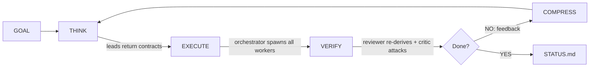

# /company

[](https://www.npmjs.com/package/company-skill) [](LICENSE) [](https://www.npmjs.com/package/company-skill)

**Define your team in markdown. Give it a goal. Walk away.**

A Claude Code skill that runs your whole company. The orchestrator delegates, workers execute in parallel, and built-in reviewers re-verify the work before it counts as done. The loop keeps running until the goal is met.

```
/company "Build the user auth system with OAuth2"
```

You write the team once in COMPANY.md and hand over a goal. By the morning STATUS.md tells you what shipped, what got rejected, and what the run learned. The playbook from one session carries into the next, so later sessions move faster than the first.

The skill is written to carry the discipline itself rather than assume a frontier model will improvise it. Every task ships with a verification command, every criterion starts failing, and nothing passes until a reviewer reproduces the evidence. A weaker model running this skill follows the same rails.

## Why /company

Run a goal yourself and you prompt each agent in turn, hope the output is right, lose every lesson when the session ends, and decide on your own when things are finished.

With /company the orchestrator reads the goal and picks the relevant employees. Leads decompose the goal into contracts with verification commands. Two reviewers gate every cycle: the Internal Reviewer re-runs the evidence and the Devil's Advocate attacks it. The playbook keeps what worked and what failed across sessions. And criteria.json holds the exit shut until every criterion passes with reproduced evidence.

## Quick start

**1. Install.** The npx path copies the skill, commands, agents, and hooks and registers the hooks in settings.json automatically. The curl path copies the same files and registers the hooks when node is available, otherwise it prints the exact manual registration steps (the hooks need node at runtime anyway).
```bash
npx company-skill install
```
or
```bash
curl -fsSL https://raw.githubusercontent.com/jagmarques/company-skill/main/install.sh | bash
```

**2. Define your team.** This step is optional. If you skip it, a minimal company is created for you.
```markdown
## Engineering
- Backend Lead, API design and database architecture
- Frontend Dev, React components and state management

## Research
- ML Scientist, model experiments and benchmarks
```

**3. Run**
```
/company "Build a REST API for user management with tests"
```

## How it works



The loop stops only when the Internal Reviewer reproduces the evidence for every criterion and the Devil's Advocate accepts. There is no iteration limit.

One structural fact shapes the whole design: sub-agents cannot spawn sub-agents. So leads plan and return task lists, and the orchestrator is the only context that ever spawns anything.

<details>
<summary><strong>THINK</strong>, the orchestrator picks employees, leads write contracts</summary>

The orchestrator (the CEO) reads the goal and COMPANY.md, decides which departments and employees are relevant (a mobile app goal does not need a Topologist), writes an active roster, then spawns all department leads in parallel in a single message.

Leads analyze and return delegation contracts, one per task: TASK, EMPLOYEE, SKILL, INPUTS, OUTPUT, DONE-WHEN, VERIFY-WITH, OUT-OF-SCOPE. A task without a verification command is rejected at the source: no command, no task.

If a lead spots a skill gap, it writes `HIRE: {role}, {why}` and the orchestrator adds the role to the team.
</details>

<details>
<summary><strong>EXECUTE</strong>, the orchestrator spawns all workers in parallel</summary>

Every worker gets one self-contained contract plus the failed approaches from the playbook. Workers that touch a repo operate in their own worktree on their own branch and stop at a draft PR. They never merge. Every finding must cite a source: a file path, a URL, or command output. Novel ideas get tagged "NOVEL - needs validation" and the reviewer adds a validation criterion for them.

A worker that fails or stalls is not coached along. It gets respawned fresh with the same contract plus the failure evidence, because a corrupted context is cheaper to replace than to repair.
</details>

<details>
<summary><strong>VERIFY</strong>, the gate that re-derives instead of trusting</summary>

The Internal Reviewer re-runs at least one verification command per criterion itself, opens the cited files, and fetches the cited URLs. Only evidence it reproduced this cycle flips a criterion to passing, and the reproduced evidence string is written into criteria.json at the same time. Anything it could not reproduce stays failing as NOT-REPRODUCED. It also scans public-facing output for unverified claims about external projects and blocks them.

The Devil's Advocate then attacks everything marked passing: was the evidence reproduced or transcribed, does the test exercise the change, what input breaks it, what surface was never checked, could it be simpler, would a real user understand it. A single unclosed gap means NOT DONE.

Only after both verdicts does the orchestrator merge the draft PRs. Workers never merge.
</details>

<details>
<summary><strong>COMPRESS</strong>, the digest keeps the orchestrator's context clean</summary>

Between cycles the digest agent compresses the finished cycle's findings into the next cycle's briefing: importance 4-5 findings in full, the rest one line each, sources always kept. The next THINK reads that briefing instead of raw transcripts, which is what keeps long runs from drowning in their own history.
</details>

## Delegation contracts

Every task in the system is written as a contract before any worker exists:

```
TASK: {one sentence, one employee}
EMPLOYEE: {role}
SKILL: {skill or "none"}
INPUTS: {paths, URLs, playbook lines pasted in}
OUTPUT: FINDING + SOURCE lines to .company/{dept}/{employee}.md
DONE-WHEN: {one machine-checkable condition}
VERIFY-WITH: {the exact command whose output proves DONE-WHEN}
OUT-OF-SCOPE: {what this task must not touch}
```

The worker runs VERIFY-WITH itself before reporting, and the reviewer runs it again before anything passes. Two independent executions of the same command, in different contexts, are the spine of the loop.

Three more rules bind every worker. Workers never spawn sub-agents (the platform refuses the call, and the contract says so up front). Long waits like CI runs go through background watchers that fail loud: a status command that errors is reported as an error, never as zero items pending. A worker whose contract needs a tool the harness deferred loads it through ToolSearch before declaring itself blocked.

## External fact verification

Workers producing public output (GitHub comments, PRs, blog posts) verify every claim about external projects against the actual docs or source before publishing. No citing from memory. The reviewer blocks unverified external claims on its own.

One strike rule: if someone corrects you, post a one-line factual correction and stop. Never argue and never guess a second time.

## Goal enforcement

The skill writes a `criteria.json` with machine-checkable success criteria:

```json
{"goal": "Build auth", "criteria": [
  {"id": 1, "description": "OAuth2 login works with Google", "passes": false, "evidence": null},
  {"id": 2, "description": "All tests pass", "passes": false, "evidence": null}
]}
```

Everything starts failing. Only the VERIFY phase flips a criterion, and only by writing the reproduced evidence into the `evidence` field at the same time.

A Stop Hook reads this file and blocks Claude from exiting until every criterion has `passes: true` and non-null evidence. There is no timing escape, and a malformed criteria.json (unparseable or wrong shape) blocks rather than failing open. The only override is `touch .company/CANCEL`. A criteria file untouched for 24 hours still blocks, but the block reason names its age and points at the cancel file, so a leftover run is surfaced for cancellation instead of silently passing.

The guard's decision matrix is pinned by an 11-case test (`tests/stop-guard.test.js`) that executes the shipped hook against fixture state: malformed JSON blocks, passes-true with null evidence blocks, the cancel file allows exactly once, stale state still blocks with its age named. A regression to the fail-closed behavior turns CI red.

## Self-improving playbook

Everything lives in one file, `.company/playbook.md`, and it grows across sessions.

After each session the orchestrator records what worked, what failed and what to use instead, what was slow and what is faster, which employees did best, and which roles to hire or deactivate. Each entry cites the cycle artifact that proves it. The playbook is pasted into lead prompts before every THINK phase, so a run that starts at session 5 knows more than it did at session 1.

The orchestrator also keeps COMPANY.md current: `[inactive]` on roles that contributed nothing, `[priority]` on the strong performers, and new rows for hired roles.

## Built-in roles

Every company gets these automatically, deduplicated by case-insensitive name if you also define them in COMPANY.md (your definition wins).

* CEO: the orchestrator itself. Picks relevant employees, merges and dedups tasks, performs the merges after review.
* Internal Reviewer (VERIFY): re-derives the evidence for every criterion and is the only role that flips criteria to passing.
* Devil's Advocate (VERIFY): attacks everything marked passing. Its probe list covers vacuous tests, unchecked surfaces, unverified external claims, needless complexity, and user clarity.
* Digest Writer (COMPRESS): compresses each cycle into the next briefing.

## Model assignment

Each agent file carries a `model` field in its frontmatter: lead, reviewer, and critic request a strong model, the worker a mid tier, the digest the cheapest. Where the harness honors per-agent model selection, that is the entire mechanism. Where it does not, agents inherit the session's model, and the skill makes no claim otherwise.

A `[opus]`, `[sonnet]`, or `[haiku]` tag on a role in COMPANY.md is a request the orchestrator passes along when spawning, when the harness supports an override.

## Commands

```
/company "Build X"      Run until X is done
/company                Run using COMPANY.md priorities
/company restart        Emit a verified continuation prompt for a fresh session
/company:run "Build X"  Same as the first
/company:status         Show last status
/company:resume         Continue from last session (re-derives state from disk)
```

## Installed skills

The skill attempts to install these on first run. Leads match a skill to each worker by task type.

* Code review uses /review (gstack).
* Bug fixes use /investigate (gstack).
* QA testing uses /qa (gstack).
* Shipping code uses /ship (gstack), which stops at a draft PR because the merge gate still applies.
* Browsing or testing a site uses /browse (gstack).
* Security audits use /secure-phase (trailofbits).
* Stateful debugging uses /gsd-debug (GSD).
* Planning work uses /gsd-plan-phase (GSD).

When no skill matches, or an install failed and the skill is missing, workers fall back to raw tools and note SKILL-MISSING in their findings.

<details>
<summary>Install more skill packs</summary>

```
/plugin marketplace add obra/superpowers-marketplace
/plugin marketplace add wshobson/agents
/plugin marketplace add alirezarezvani/claude-skills
```
</details>

## What gets created

State lives in `./.company/` in the current project. Set the `COMPANY_DIR` environment variable to relocate it (the hooks honor it too).

```
.company/
  GOAL.md                      The goal verbatim
  criteria.json                Machine-checkable goal state
  playbook.md                  Accumulated lessons (THE self-improvement file)
  active-roster.md             Employees activated for this goal
  active-tasks.md              Deduplicated task list
  STATUS.md                    Final report
  cycles/cycle-{N}-briefing.md Cycle plan (written by THINK or the digest)
  cycles/cycle-{N}-tasks.md    Merged delegation contracts
  cycles/cycle-{N}-review.md   Per-criterion verdicts and merge decisions
  {dept}/                      Per-employee findings (persist across sessions)
```

## Design choices

One file defines the team. COMPANY.md is the only thing you write. Delegation, task routing, and quality checks all happen on their own.

No iteration limit. The loop runs until criteria.json says it is done, however many cycles that takes, and only once the Reviewer and the Devil's Advocate both accept.

The harness carries the quality. Contracts, verification commands, failing-by-default criteria, re-derivation, and respawn-on-failure are all structural. None of it depends on the model remembering to be careful.

Self-improvement over configuration. Rather than tune prompts, the company learns from its own failures. The playbook grows across sessions and roles get tagged by performance.

Reports stay short. Every employee, reviewer, and the orchestrator reports the conclusion first and the evidence that backs it, then stops. The one thing brevity never cuts is the source: a claim still ships with the command, file, or link that proves it.

## Project structure

```
COMPANY.md           Your team definition (the only file you edit)
skill/SKILL.md       The skill logic (THINK > EXECUTE > VERIFY loop)
agents/              Subagent definitions (lead, worker, reviewer, critic, digest)
hooks/               Stop guard, session restore, precompact
commands/            run.md, resume.md, status.md
examples/            Sample team configurations
scripts/check.sh     Repo checks (hook syntax, frontmatter, leak greps)
install.sh           Curl installer (skill + commands + agents + hooks)
bin/install.js       npx installer (same coverage)
```

## Development

`bash scripts/check.sh` parses every hook and installer, validates frontmatter, greps for content that must never ship (private rule references, hardcoded IPs, em dashes, leaked operator brand names), and executes the stop-guard decision-matrix test. Run the test alone with `node tests/stop-guard.test.js`. CI runs the same script on every pull request.

## Examples

* [`startup.md`](examples/startup.md): a 10-person startup.
* [`research-lab.md`](examples/research-lab.md): an academic group.
* [`dev-team.md`](examples/dev-team.md): a dev sprint.
* [`nexusquant.md`](examples/nexusquant.md): a full research company.

## License

MIT

## Restarting when context fills up (`/company restart`)

A long autonomous run will eventually fill the model's context window. Instead of re-explaining the whole state to a fresh session by hand, run:

```
/company restart
```

It refreshes the on-disk state (`criteria.json`, `STATUS.md`, `NEXT.md`, the playbook) and emits one self-contained continuation prompt. That prompt carries the goal, a trust-nothing re-derivation first step, the exact merged, in-flight, and pending state with PR numbers and commit SHAs, the pending task list, the waits that still need your explicit go, the gates to honor, and the environment. Copy the block, run `/clear`, paste it into a new session, and you resume with nothing lost.

The prompt is never hand-written from memory. The procedure runs a Source-Verifier, a Devil's-Advocate, and a Completeness pass to re-derive every SHA, PR, and CI claim live before it emits, and it outputs only the prompt block with no trailing commentary. If those passes cannot run (rate limits, no gh credentials), unverified lines are marked UNVERIFIED instead of asserted.

Before it emits, the restart quiesces every background agent still running. Because `/clear` orphans a live sub-agent and loses its uncommitted work, the procedure first finishes or stops each one and preserves real work as a draft PR, then lists those PRs in the prompt so the fresh session resumes them. A restart that orphans live work is treated as a failed restart.

When it fires on its own, and the honest limits:

* At compaction, the reliable trigger. Claude Code has no hook that fires at a context percentage. The closest hard wiring is compaction. The `PreCompact` hook (`hooks/precompact.js`) snapshots state to `.company/.checkpoint.md`, and the post-compaction `SessionStart` hook (`hooks/session-restore.js`, matcher `compact`) injects the restart instruction through `hookSpecificOutput.additionalContext`, the field that actually reaches the model. `PreCompact` is shell-only, so it cannot emit the prompt itself. The model does that right after, nudged by the restore hook.
* Around 50 percent is best-effort, not mechanical. The skill tells the model to self-trigger when it sees a context-usage warning at or above 50 percent, but nothing enforces it. No 50 percent hook exists, so it may not fire until compaction. Treat `/company restart` typed by hand as the dependable control.
