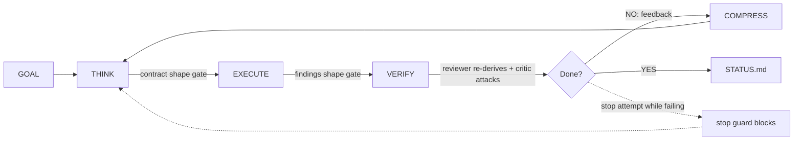

# /company

[](https://www.npmjs.com/package/company-skill) [](LICENSE) [](https://www.npmjs.com/package/company-skill)

**Your agent stops when it feels done. This makes it stop only when the work is actually done.**

You define a team in one markdown file, hand it a goal, and walk away while it builds, reviews its own work, and keeps going until every success criterion passes with evidence a second agent reproduced. A stop hook reads criteria.json and physically blocks exit until then, and that guard is pinned by a 22-check test suite that runs green in CI.

```bash
npx company-skill install
```

```
/company "Build a REST API for user management with tests"
```

Optionally define your team first in `COMPANY.md` (skip it and a minimal company is created):

```markdown
## Engineering
- Backend Lead, API design and database architecture
- Frontend Dev, React components and state management
```

## How it works



The architecture is model agnostic: the orchestration discipline frontier models like Claude Fable 5 carry built in (delegation contracts, verify layers, failing-by-default criteria) ships here as structural artifacts, so any model running any role follows the same rails. The orchestrator reads the goal and activates only the relevant employees. Leads decompose the goal into delegation contracts, workers execute them in parallel waves, and two reviewers gate every cycle: the Internal Reviewer re-runs the evidence and the Devil's Advocate attacks it. There is no iteration limit. The harness carries the quality, so none of it depends on the model remembering to be careful.

## Delegation contracts

A task does not exist until it is a filled contract:

```
TASK: one sentence, one employee
EMPLOYEE: role from the roster
SKILL: routed skill, or none
INPUTS: paths and context, paste-complete
OUTPUT: FINDING + SOURCE lines to the employee's findings file
DONE-WHEN: one machine-checkable condition
VERIFY-WITH: the exact command that proves DONE-WHEN
OUT-OF-SCOPE: what this task must not touch
DEPENDS-ON: task numbers that must finish first, or none
```

`scripts/check-contracts.js` rejects a contract missing a field, carrying a vacuous VERIFY-WITH, or declaring a missing, self-referencing, or cyclic dependency. Workers run VERIFY-WITH before reporting and the reviewer runs it again: two independent executions of the same command are the spine of the loop. `scripts/check-findings.js` rejects any FINDING without a SOURCE. Workers producing public output verify every external claim against the actual source first, and a correction gets one factual reply, never an argument.

## Goal enforcement

The skill writes `criteria.json` where every criterion starts failing, and only the VERIFY phase flips one, writing the reproduced evidence at the same time. A Stop Hook blocks the session from exiting until every criterion has `passes: true` and non-null evidence. Malformed state blocks rather than failing open. The criterion id set locks on first sight (`criteria.lock`), so deleting a hard criterion blocks instead of unlocking. The gate is session-scoped through `.company/OWNER`: only sessions that own the run are ever blocked, and the compaction hooks apply the same scoping. The only override is `touch .company/CANCEL`, reserved for the human operator, and block reasons deliberately never name it.

All of that is pinned by the 22-check decision-matrix test (`node tests/stop-guard.test.js`) plus the 8-check contract-gate test, both run by CI on every pull request.

## Self-improving playbook

After each session the orchestrator records what worked, what failed and what to use instead, and which employees performed, each entry citing the artifact that proves it. The playbook is pasted into lead prompts before every THINK, so session 5 starts smarter than session 1.

## Roles and models

Built-in roles always exist: the CEO orchestrator, the Internal Reviewer, the Devil's Advocate, and the Digest writer that compresses each cycle. Agent files carry per-role model tags (strong for leads and reviewers, mid-tier for workers, cheapest for the digest), and that tunes cost and speed only. The discipline binds through the artifacts and gates for whichever model runs each role.

## Commands

```
/company "Build X"      Run until X is done
/company                Run using COMPANY.md priorities
/company restart        Emit a verified continuation prompt for a fresh session
/company:status         Show last status
/company:resume         Continue from last session (re-derives state from disk)
```

## What gets created

State lives in `./.company/` (relocate with `COMPANY_DIR`, the hooks honor it):

```
.company/
  GOAL.md          criteria.json     playbook.md
  active-roster.md active-tasks.md   STATUS.md
  cycles/          per-cycle briefing, contracts, review
  {dept}/          per-employee findings, persist across sessions
```

## Skill routing

Leads route tasks to installed skills (/review, /investigate, /qa, /ship, /browse, /secure-phase, /gsd-debug, /gsd-plan-phase) and the installer fetches the packs on first run. When a skill is missing, workers fall back to raw tools and note SKILL-MISSING.

## Restarting when context fills up

`/company restart` refreshes the on-disk state and emits one self-contained continuation prompt: the goal, a trust-nothing re-derivation first step, exact merged and pending state with SHAs, the waits that need your go, the gates, and the environment. Copy the block, `/clear`, paste, resume with nothing lost.

The prompt is never hand-written from memory: a Source-Verifier, a Devil's Advocate, and a Completeness pass re-derive every SHA, PR, and CI claim live before it emits, and unverifiable lines are marked UNVERIFIED. Before emitting, the restart quiesces every background agent and preserves real work as draft PRs, because `/clear` orphans live sub-agents. At compaction the PreCompact hook snapshots state and the SessionStart hook injects the restart instruction, the one harness-reliable trigger. The 50 percent self-trigger is best-effort, so treat a typed `/company restart` as the dependable control.

## Development

`bash scripts/check.sh` parses every hook and installer, validates frontmatter, greps for content that must never ship, and executes both test suites. CI runs the same script on every pull request.

## Examples

[`startup.md`](examples/startup.md), [`research-lab.md`](examples/research-lab.md), [`dev-team.md`](examples/dev-team.md), [`nexusquant.md`](examples/nexusquant.md).

## License

MIT
